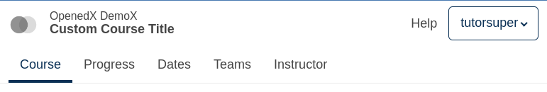
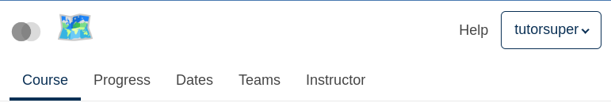
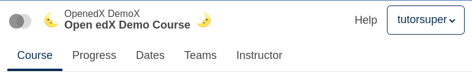

# Course Info Slot

### Slot ID: `course_info_slot`

## Description

This slot is used to replace/modify/hide the course info.

## Examples

### Replace Course Title

The following `env.config.jsx` will replace the course title.



```jsx
import { PLUGIN_OPERATIONS } from '@openedx/frontend-plugin-framework';

const replaceCourseTitle = ( widget ) => {
  widget.content.courseTitle = "Custom Course Title";
  return widget;
};

const config = {
  pluginSlots: {
    course_info_slot: {
      keepDefault: true,
      plugins: [
        {
          op: PLUGIN_OPERATIONS.Modify,
          widgetId: 'default_contents',
          fn: replaceCourseTitle,
        },
      ]
    },
  },
}

export default config;
```

### Replace Course Info with Custom Component

The following `env.config.jsx` will replace the course info entirely (in this case with a centered 🗺️ `h1`)



```jsx
import { DIRECT_PLUGIN, PLUGIN_OPERATIONS } from '@openedx/frontend-plugin-framework';

const config = {
  pluginSlots: {
    course_info_slot: {
      keepDefault: false,
      plugins: [
        {
          op: PLUGIN_OPERATIONS.Insert,
          widget: {
            id: 'custom_course_info_component',
            type: DIRECT_PLUGIN,
            RenderWidget: () => (
              <h1 style={{textAlign: 'center'}}>🗺️</h1>
            ),
          },
        },
      ]
    }
  },
}

export default config;
```

### Add Custom Components before and after Course Info

The following `env.config.jsx` will place custom components before and after the course info  (in this case centered `h1`s with 🌜 and 🌛).



```jsx
import { DIRECT_PLUGIN, PLUGIN_OPERATIONS } from '@openedx/frontend-plugin-framework';

const config = {
  pluginSlots: {
    course_info_slot: {
      keepDefault: true,
      plugins: [
        {
          op: PLUGIN_OPERATIONS.Insert,
          widget: {
            id: 'custom_before_course_info_component',
            type: DIRECT_PLUGIN,
            priority: 10,
            RenderWidget: () => (
              <h3 style={{
                marginTop: 'auto',
                marginBottom: 'auto',
                marginRight: '0.5rem',
              }}>🌜</h3>
            ),
          },
        },
        {
          op: PLUGIN_OPERATIONS.Insert,
          widget: {
            id: 'custom_after_course_info_component',
            type: DIRECT_PLUGIN,
            priority: 90,
            RenderWidget: () => (
              <h3 style={{
                marginTop: 'auto',
                marginBottom: 'auto',
                marginLeft: '0.5rem',
              }}>🌛</h3>
            ),
          },
        },
      ]
    },
  },
}

export default config;
```
