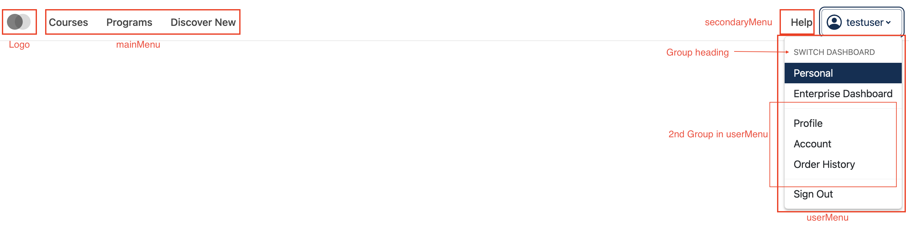
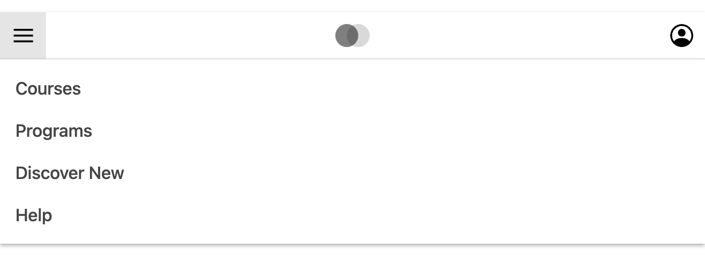
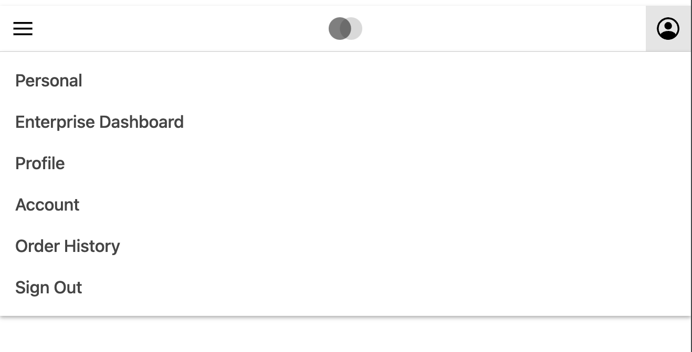

.. title:: Custom Header Component Documentation

Custom Header Component
=======================

Overview
--------

The ``Header`` component is used to display a header with a provided ``mainMenuItems``,
``secondaryMenuItems``, and ``userMenuItems`` props. If props are provided, the component will use them; otherwise,
if any of the props ``(mainMenuItems, secondaryMenuItems, userMenuItems)`` are not provided, default
items will be displayed. This component provides flexibility in customization, making it suitable for a wide
range of applications.

Props Details
-------------

The `Header` component accepts the following **optional** props for customization:

``mainMenuItems``
*****************

The main menu items is a list of menu items objects. On desktop screens, these items are displayed on the left side next to the logo icon.
On mobile screens, the main menu is displayed as a dropdown menu triggered by a hamburger icon. The main menu dropdown appears below the logo when opened.

Example:
::

   [
       { type: 'item', href: '/courses', content: 'Courses', isActive: true },
       { type: 'item', href: '/programs', content: 'Programs' },
       { type: 'item', href: '/discover', content: 'Discover New', disabled, true },
       {
           type: 'submenu',
           content: 'Sub Menu Item',
           submenuContent: (
             <>
                
<a rel="noopener" href="#">Submenu item 1</a>

                
<a rel="noopener" href="#">Submenu item 2</a>

             </>
           ),
       },
   ]

**Submenu Implementation**

To implement a submenu, set the type to ``submenu`` and provide a ``submenuContent`` property.
The submenuContent should be a React component (as shown in above example) that can be rendered.

**Note:**

- The ``type`` should be ``item`` or ``submenu``. If type is ``submenu``, it should contain ``submenuContent`` instead of ``href``.

- If any item is to be disabled, we can pass optional ``disabled: true`` in that item object and

- If any item is to be active, we can pass optional ``isActive: true`` in that item object

secondaryMenuItems
******************

The secondary menu items has same structure as ``mainMenuItems``. On desktop screen, these items are displayed on the right of header just before the userMenu avatar and on mobile screen,
these items are displayed below the mainMenu items in dropdown.

Example:
::

   [
       { type: 'item', href: '/help', content: 'Help' },
   ]

userMenuItems
*************

The user menu items is list of objects. On desktop screens, these items are displayed as a dropdown menu on the most right side of the header. The dropdown is opened by clicking on the avatar icon, which is typically located at the far right of the header.
On mobile screens, the user menu is also displayed as a dropdown menu, appearing under the avatar icon.

Each object represents a group in the user menu. Each object contains the ``heading`` and
list of menu items to be displayed in that group. Heading is optional and will be displayed only if passed. There can
be multiple groups. For a normal user menu, a single group can be passed with empty heading.

Example:
::

   [
       {
           heading: '',
           items: [
               { type: 'item', href: '/profile', content: 'Profile' },
               { type: 'item', href: '/logout', content: 'Logout' }
           ]
       },
   ]

Screenshots
***********

Desktop:

Mobile:

Some Important Notes
--------------------

- Intl formatted strings should be passed in content attribute.
- Only menu items in the main menu can be disabled.
- Menu items in the main menu and user menu can have ``isActive`` prop.
