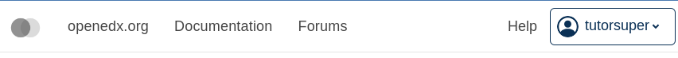
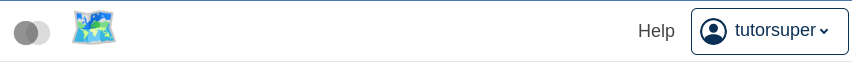
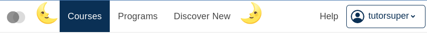

# Desktop Main Menu Slot

### Slot ID: `desktop_main_menu_slot`

## Description

This slot is used to replace/modify/hide the desktop main menu.

## Examples

### Modify Items

The following `env.config.jsx` will modify the items in the desktop main menu.



```jsx
import { PLUGIN_OPERATIONS } from '@openedx/frontend-plugin-framework';

const modifyMainMenu = ( widget ) => {
  widget.content.menu = [
    {
      type: 'item',
      href: 'https://openedx.org/',
      content: 'openedx.org',
    },
    {
      type: 'item',
      href: 'https://docs.openedx.org/en/latest/',
      content: 'Documentation',
    },
    {
      type: 'item',
      href: 'https://discuss.openedx.org/',
      content: 'Forums',
    }
  ];
  return widget;
};

const config = {
  pluginSlots: {
    desktop_main_menu_slot: {
      keepDefault: true,
      plugins: [
        {
          op: PLUGIN_OPERATIONS.Modify,
          widgetId: 'default_contents',
          fn: modifyMainMenu,
        },
      ]
    },
  },
}

export default config;
```

### Replace Menu with Custom Component

The following `env.config.jsx` will replace the desktop main menu entirely (in this case with a centered 🗺️ `h1`)



```jsx
import { DIRECT_PLUGIN, PLUGIN_OPERATIONS } from '@openedx/frontend-plugin-framework';

const config = {
  pluginSlots: {
    desktop_main_menu_slot: {
      keepDefault: false,
      plugins: [
        {
          op: PLUGIN_OPERATIONS.Insert,
          widget: {
            id: 'custom_main_menu_component',
            type: DIRECT_PLUGIN,
            RenderWidget: () => (
              <h1 style={{textAlign: 'center'}}>🗺️</h1>
            ),
          },
        },
      ]
    },
  },
}

export default config;
```

### Add Custom Components before and after Menu

The following `env.config.jsx` will place custom components before and after the desktop main menu  (in this case centered `h1`s with 🌜 and 🌛).



```jsx
import { DIRECT_PLUGIN, PLUGIN_OPERATIONS } from '@openedx/frontend-plugin-framework';

const config = {
  pluginSlots: {
    desktop_main_menu_slot: {
      keepDefault: true,
      plugins: [
        {
          op: PLUGIN_OPERATIONS.Insert,
          widget: {
            id: 'custom_before_main_menu_component',
            type: DIRECT_PLUGIN,
            priority: 10,
            RenderWidget: () => (
              <h1 style={{textAlign: 'center'}}>🌜</h1>
            ),
          },
        },
        {
          op: PLUGIN_OPERATIONS.Insert,
          widget: {
            id: 'custom_after_main_menu_component',
            type: DIRECT_PLUGIN,
            priority: 90,
            RenderWidget: () => (
              <h1 style={{textAlign: 'center'}}>🌛</h1>
            ),
          },
        },
      ]
    },
  },
}

export default config;
```

