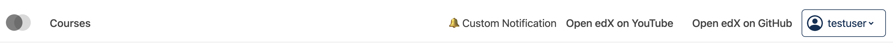
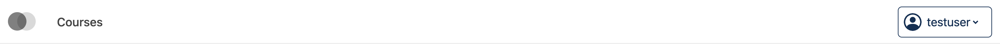
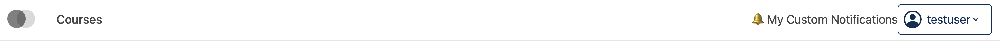
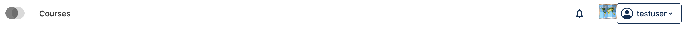
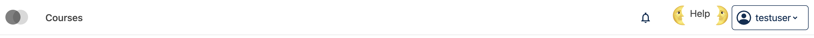
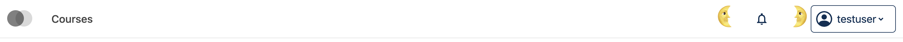

# Desktop Secondary Menu Slot

## Slots

| Slot ID | Description |
|---------|-------------|
| `org.openedx.frontend.layout.header_desktop_secondary_menu.v2` | Full secondary menu area: notification tray + menu items |
| `org.openedx.frontend.layout.header_desktop_secondary_menu.v1` | Menu items only (no notifications) |

### Slot ID Aliases
* `desktop_secondary_menu_slot` → mapped to `v1`

---

## `v2` - Full Secondary Menu Area

### Slot ID: `org.openedx.frontend.layout.header_desktop_secondary_menu.v2`

**Default Content:**
- **Notification Tray** (via `HeaderNotificationsSlot`) — Rendered before menu items
- **`DesktopSecondaryMenuSlotV1`** — Wraps the secondary menu items

---

## `v1` — Menu Items Only

### Slot ID: `org.openedx.frontend.layout.header_desktop_secondary_menu.v1`

**Default Content:**
- **Secondary Menu Items** — Links like "New", "Help", etc.

---

## Examples

### Modify Notifications Tray and Menu Items

The following `env.config.jsx` modifies both the notification tray content and the desktop secondary menu items simultaneously.


```jsx
import React from 'react';
import { PLUGIN_OPERATIONS } from '@openedx/frontend-plugin-framework';

const modifySecondaryMenu = (widget) => {
  widget.content.menu = [
    {
      type: 'item',
      href: 'https://www.youtube.com/c/openedx',
      content: 'Open edX on YouTube',
    },
    {
      type: 'item',
      href: 'https://github.com/openedx/',
      content: 'Open edX on GitHub',
    },
  ];
  return widget;
};

const config = {
  pluginSlots: {
    'org.openedx.frontend.layout.header_desktop_secondary_menu.v1': {
      keepDefault: true,
      plugins: [
        {
          op: PLUGIN_OPERATIONS.Modify,
          widgetId: 'default_contents',
          fn: modifySecondaryMenu,
        },
      ],
    },
    'org.openedx.frontend.layout.header_notifications_tray.v1': {
      keepDefault: true,
      plugins: [
        {
          op: PLUGIN_OPERATIONS.Modify,
          widgetId: 'default_contents',
          fn: (widget) => {
            widget.RenderWidget = <span>🔔 Custom Notification</span>;
            return widget;
          },
        },
      ],
    },
  },
};

export default config;
```

### Hide Notifications Tray



```jsx
import { PLUGIN_OPERATIONS } from '@openedx/frontend-plugin-framework';

const config = {
  pluginSlots: {
    'org.openedx.frontend.layout.header_notifications_tray.v1': {
      keepDefault: false,
      plugins: [],
    },
  },
};

export default config;
```

### Replace Notifications Tray with Custom Component

The following `env.config.jsx` replaces the notification tray with a custom component.



```jsx
import React from 'react';
import { DIRECT_PLUGIN, PLUGIN_OPERATIONS } from '@openedx/frontend-plugin-framework';

const config = {
  pluginSlots: {
    'org.openedx.frontend.layout.header_notifications_tray.v1': {
      keepDefault: false,
      plugins: [
        {
          op: PLUGIN_OPERATIONS.Insert,
          widget: {
            id: 'custom_notifications_component',
            type: DIRECT_PLUGIN,
            priority: 50,
            RenderWidget: () => (
              <span>🔔 My Custom Notifications</span>
            ),
          },
        },
      ],
    },
  },
};

export default config;
```

### Replace Menu with Custom Component

The following `env.config.jsx` replaces the desktop secondary menu items entirely (in this case with a centered 🗺️ `h1`):



```jsx
import React from 'react';
import { DIRECT_PLUGIN, PLUGIN_OPERATIONS } from '@openedx/frontend-plugin-framework';

const config = {
  pluginSlots: {
    'org.openedx.frontend.layout.header_desktop_secondary_menu.v1': {
      keepDefault: false,
      plugins: [
        {
          op: PLUGIN_OPERATIONS.Insert,
          widget: {
            id: 'custom_secondary_menu_component',
            type: DIRECT_PLUGIN,
            priority: 50,
            RenderWidget: () => (
              <h1 style={{ textAlign: 'center' }}>🗺️</h1>
            ),
          },
        },
      ],
    },
  },
};

export default config;
```

### Add Custom Components before and after Menu

The following `env.config.jsx` places custom components before and after the desktop secondary menu items (in this case centered `h1`s with 🌜 and 🌛). Components with `priority < 50` appear before the default content; `priority > 50` appear after.



```jsx
import React from 'react';
import { DIRECT_PLUGIN, PLUGIN_OPERATIONS } from '@openedx/frontend-plugin-framework';

const config = {
  pluginSlots: {
    'org.openedx.frontend.layout.header_desktop_secondary_menu.v1': {
      keepDefault: true,
      plugins: [
        {
          op: PLUGIN_OPERATIONS.Insert,
          widget: {
            id: 'custom_before_menu_component',
            type: DIRECT_PLUGIN,
            priority: 10,
            RenderWidget: () => (
              <h1 style={{ textAlign: 'center' }}>🌜</h1>
            ),
          },
        },
        {
          op: PLUGIN_OPERATIONS.Insert,
          widget: {
            id: 'custom_after_menu_component',
            type: DIRECT_PLUGIN,
            priority: 90,
            RenderWidget: () => (
              <h1 style={{ textAlign: 'center' }}>🌛</h1>
            ),
          },
        },
      ],
    },
  },
};

export default config;
```

### Add Custom Components before and after Notifications Tray

The following `env.config.jsx` places custom components before and after the notifications tray. Because `HeaderNotificationsSlot` is a nested slot inside `v2`, target `v2` directly and use `Insert` with priorities around the default content (priority 50).



```jsx
import React from 'react';
import { DIRECT_PLUGIN, PLUGIN_OPERATIONS } from '@openedx/frontend-plugin-framework';

const config = {
  pluginSlots: {
    'org.openedx.frontend.layout.header_desktop_secondary_menu.v2': {
      keepDefault: true,
      plugins: [
        {
          op: PLUGIN_OPERATIONS.Insert,
          widget: {
            id: 'custom_before_notifications_component',
            type: DIRECT_PLUGIN,
            priority: 10,
            RenderWidget: () => (
              <h1 style={{ textAlign: 'center' }}>🌜</h1>
            ),
          },
        },
        {
          op: PLUGIN_OPERATIONS.Insert,
          widget: {
            id: 'custom_after_notifications_component',
            type: DIRECT_PLUGIN,
            priority: 90,
            RenderWidget: () => (
              <h1 style={{ textAlign: 'center' }}>🌛</h1>
            ),
          },
        },
      ],
    },
  },
};

export default config;
```
