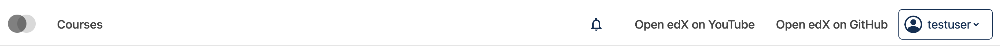

# Desktop Secondary Menu Slot — v1 (Menu Items Only)

### Slot ID: `org.openedx.frontend.layout.header_desktop_secondary_menu.v1`

### Slot ID Aliases
* `desktop_secondary_menu_slot`

**Default Content:**
- **Secondary Menu Items** - Links like "New", "Help", etc.

> **Note:** This slot contains only the menu items. The notification tray + Menu items is rendered by the parent [`v2` slot](../v2/). To customize the notification tray, see the [`HeaderNotificationsSlot` docs](../../HeaderNotificationsSlot/).

---

## Examples

### Modify Secondary Menu Items

The following `env.config.jsx` replaces the secondary menu links with custom ones.


```jsx
import React from 'react';
import { PLUGIN_OPERATIONS } from '@openedx/frontend-plugin-framework';

const modifySecondaryMenu = (widget) => {
  widget.content.menu = [
    {
      type: 'item',
      href: 'https://www.youtube.com/c/openedx',
      content: 'Open edX on YouTube',
    },
    {
      type: 'item',
      href: 'https://github.com/openedx/',
      content: 'Open edX on GitHub',
    },
  ];
  return widget;
};

const config = {
  pluginSlots: {
    'org.openedx.frontend.layout.header_desktop_secondary_menu.v1': {
      keepDefault: true,
      plugins: [
        {
          op: PLUGIN_OPERATIONS.Modify,
          widgetId: 'default_contents',
          fn: modifySecondaryMenu,
        },
      ],
    },
  },
};

export default config;
```

### Replace Menu with Custom Component

The following `env.config.jsx` replaces the desktop secondary menu items entirely (in this case with a centered 🗺️ `h1`):


```jsx
import React from 'react';
import { DIRECT_PLUGIN, PLUGIN_OPERATIONS } from '@openedx/frontend-plugin-framework';

const config = {
  pluginSlots: {
    'org.openedx.frontend.layout.header_desktop_secondary_menu.v1': {
      keepDefault: false,
      plugins: [
        {
          op: PLUGIN_OPERATIONS.Insert,
          widget: {
            id: 'custom_secondary_menu_component',
            type: DIRECT_PLUGIN,
            priority: 50,
            RenderWidget: () => (
              <h1 style={{ textAlign: 'center' }}>🗺️</h1>
            ),
          },
        },
      ],
    },
  },
};

export default config;
```

### Add Custom Components before and after Menu

The following `env.config.jsx` places custom components before and after the desktop secondary menu items (in this case centered `h1`s with 🌜 and 🌛). Components with `priority < 50` appear before the default content; `priority > 50` appear after.


```jsx
import React from 'react';
import { DIRECT_PLUGIN, PLUGIN_OPERATIONS } from '@openedx/frontend-plugin-framework';

const config = {
  pluginSlots: {
    'org.openedx.frontend.layout.header_desktop_secondary_menu.v1': {
      keepDefault: true,
      plugins: [
        {
          op: PLUGIN_OPERATIONS.Insert,
          widget: {
            id: 'custom_before_menu_component',
            type: DIRECT_PLUGIN,
            priority: 10,
            RenderWidget: () => (
              <h1 style={{ textAlign: 'center' }}>🌜</h1>
            ),
          },
        },
        {
          op: PLUGIN_OPERATIONS.Insert,
          widget: {
            id: 'custom_after_menu_component',
            type: DIRECT_PLUGIN,
            priority: 90,
            RenderWidget: () => (
              <h1 style={{ textAlign: 'center' }}>🌛</h1>
            ),
          },
        },
      ],
    },
  },
};

export default config;
```
