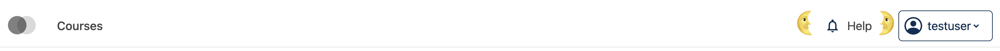
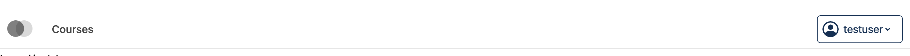
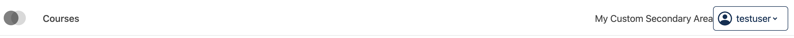

# Desktop Secondary Menu Slot — v2 (Full Secondary Menu Area)

### Slot ID: `org.openedx.frontend.layout.header_desktop_secondary_menu.v2`

**Default Content:**
- **Notification Tray** (via [`HeaderNotificationsSlot`](../../HeaderNotificationsSlot/)) — Rendered before the secondary menu
- **Secondary Menu** (via [`DesktopSecondaryMenuSlotV1`](../v1/)) — Rendered after the notification tray

This slot wraps the entire right hand secondary area of the desktop header. Use it to add, hide, or replace the whole area.

---

## Examples

### Add Custom Components before and after the Secondary Area

The following `env.config.jsx` inserts a custom component before the notification tray (`priority: 10`) and another after the secondary menu (`priority: 90`).



```jsx
import React from 'react';
import { DIRECT_PLUGIN, PLUGIN_OPERATIONS } from '@openedx/frontend-plugin-framework';

const config = {
  pluginSlots: {
    'org.openedx.frontend.layout.header_desktop_secondary_menu.v2': {
      keepDefault: true,
      plugins: [
        {
          op: PLUGIN_OPERATIONS.Insert,
          widget: {
            id: 'custom_before_secondary_area',
            type: DIRECT_PLUGIN,
            priority: 10,
            RenderWidget: () => (
              <h1 style={{ textAlign: 'center' }}>🌜</h1>
            ),
          },
        },
        {
          op: PLUGIN_OPERATIONS.Insert,
          widget: {
            id: 'custom_after_secondary_area',
            type: DIRECT_PLUGIN,
            priority: 90,
            RenderWidget: () => (
              <h1 style={{ textAlign: 'center' }}>🌛</h1>
            ),
          },
        },
      ],
    },
  },
};

export default config;
```

### Hide the Entire Secondary Area

The following `env.config.jsx` removes both the notification tray and the secondary menu from the desktop header.



```jsx
import { PLUGIN_OPERATIONS } from '@openedx/frontend-plugin-framework';

const config = {
  pluginSlots: {
    'org.openedx.frontend.layout.header_desktop_secondary_menu.v2': {
      keepDefault: true,
      plugins: [
        {
          op: PLUGIN_OPERATIONS.Hide,
          widgetId: 'default_contents',
        },
      ],
    },
  },
};

export default config;
```

### Replace the Entire Secondary Area with a Custom Component

The following `env.config.jsx` replaces the notification tray and secondary menu with a single custom component.



```jsx
import React from 'react';
import { DIRECT_PLUGIN, PLUGIN_OPERATIONS } from '@openedx/frontend-plugin-framework';

const config = {
  pluginSlots: {
    'org.openedx.frontend.layout.header_desktop_secondary_menu.v2': {
      keepDefault: false,
      plugins: [
        {
          op: PLUGIN_OPERATIONS.Insert,
          widget: {
            id: 'custom_secondary_area',
            type: DIRECT_PLUGIN,
            priority: 50,
            RenderWidget: () => (
              <span>My Custom Secondary Area</span>
            ),
          },
        },
      ],
    },
  },
};

export default config;
```
