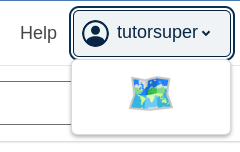
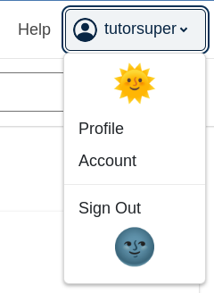

# Desktop User Menu Slot

### Slot ID: `desktop_user_menu_slot`

## Description

This slot is used to replace/modify/hide the desktop user menu.

## Examples

### Modify Items

The following `env.config.jsx` will modify the items in the desktop user menu.


```jsx
import { PLUGIN_OPERATIONS } from '@openedx/frontend-plugin-framework';

const modifyUserMenu = ( widget ) => {
  widget.content.menu = [
    {
      items: [
        {
          type: 'item',
          href: 'https://openedx.org/',
          content: 'openedx.org',
        },
        {
          type: 'item',
          href: 'https://docs.openedx.org/en/latest/',
          content: 'Documentation',
        },
      ]
    },
    {
      items: [
        {
          type: 'item',
          href: 'https://discuss.openedx.org/',
          content: 'Forums',
        }
      ]
    }
  ];
  return widget;
};

const config = {
  pluginSlots: {
    desktop_user_menu_slot: {
      keepDefault: true,
      plugins: [
        {
          op: PLUGIN_OPERATIONS.Modify,
          widgetId: 'default_contents',
          fn: modifyUserMenu,
        },
      ]
    },
  },
}

export default config;
```

### Replace Menu with Custom Component

The following `env.config.jsx` will replace the desktop user menu entirely (in this case with a centered 🗺️ `h1`)



```jsx
import { DIRECT_PLUGIN, PLUGIN_OPERATIONS } from '@openedx/frontend-plugin-framework';

const config = {
  pluginSlots: {
    desktop_user_menu_slot: {
      keepDefault: false,
      plugins: [
        {
          op: PLUGIN_OPERATIONS.Insert,
          widget: {
            id: 'custom_user_menu_component',
            type: DIRECT_PLUGIN,
            RenderWidget: () => (
              <h1 style={{textAlign: 'center'}}>🗺️</h1>
            ),
          },
        },
      ]
    },
  },
}

export default config;
```

### Add Custom Components before and after Menu

The following `env.config.jsx` will place custom components before and after the desktop user menu (in this case centered `h1`s with 🌞 and 🌚).



```jsx
import { DIRECT_PLUGIN, PLUGIN_OPERATIONS } from '@openedx/frontend-plugin-framework';

const config = {
  pluginSlots: {
    desktop_user_menu_slot: {
      keepDefault: true,
      plugins: [
        {
          op: PLUGIN_OPERATIONS.Insert,
          widget: {
            id: 'custom_before_user_menu_component',
            type: DIRECT_PLUGIN,
            priority: 10,
            RenderWidget: () => (
              <h1 style={{textAlign: 'center'}}>🌞</h1>
            ),
          },
        },
        {
          op: PLUGIN_OPERATIONS.Insert,
          widget: {
            id: 'custom_after_user_menu_component',
            type: DIRECT_PLUGIN,
            priority: 90,
            RenderWidget: () => (
              <h1 style={{textAlign: 'center'}}>🌚</h1>
            ),
          },
        },
      ]
    },
  },
}

export default config;
```
