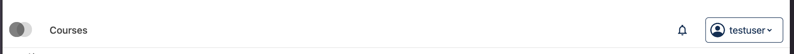
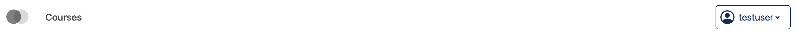
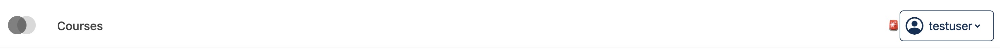

# Header Notifications Slot

### Slot ID: `org.openedx.frontend.layout.header_notifications_tray.v1`

## Description

This slot renders the notifications tray (bell icon + notification popover) from `@edx/frontend-plugin-notifications` by default.


**Important:** This slot is **not used standalone** in headers. Instead, it is embedded within the default content of three parent slots:

1. **Desktop Header** — via `org.openedx.frontend.layout.header_desktop_secondary_menu.v2`
   Notifications appear before secondary menu items (e.g., "New", "Help")

2. **Learning Header** — via `org.openedx.frontend.layout.learning_header_actions.v2`
   Notifications appear before the help link

3. **Studio Header** — via `org.openedx.frontend.layout.studio_header_actions.v2`
   Notifications appear before the search button

## Slot Hierarchy

```
Desktop Header
└── org.openedx.frontend.layout.header_desktop_secondary_menu.v2
    ├── org.openedx.frontend.layout.header_notifications_tray.v1 ← This slot
    └── org.openedx.frontend.layout.header_desktop_secondary_menu.v1 (menu items only)

Learning Header
└── org.openedx.frontend.layout.learning_header_actions.v2
    ├── org.openedx.frontend.layout.header_notifications_tray.v1 ← This slot
    └── org.openedx.frontend.layout.learning_header_actions.v1 (help link only)

Studio Header
└── org.openedx.frontend.layout.studio_header_actions.v2
    ├── org.openedx.frontend.layout.header_notifications_tray.v1 ← This slot
    └── org.openedx.frontend.layout.studio_header_actions.v1 (search button only)
```

## Examples

### Hide Notifications Globally
The following `env.config.jsx` will hide the notifications tray across all headers:



```jsx
import { PLUGIN_OPERATIONS } from '@openedx/frontend-plugin-framework';

const config = {
  pluginSlots: {
    'org.openedx.frontend.layout.header_notifications_tray.v1': {
      keepDefault: true,
      plugins: [
        {
          op: PLUGIN_OPERATIONS.Hide,
          widgetId: 'default_contents',
        },
      ]
    },
  },
}

export default config;
```

### Add Custom Alert Icon Before Notifications

The following `env.config.jsx` will insert a custom alert icon before the notifications bell:


```jsx
import { DIRECT_PLUGIN, PLUGIN_OPERATIONS } from '@openedx/frontend-plugin-framework';

const config = {
  pluginSlots: {
    'org.openedx.frontend.layout.header_notifications_tray.v1': {
      keepDefault: true,
      plugins: [
        {
          op: PLUGIN_OPERATIONS.Modify,
          widgetId: 'default_contents',
          fn: (widget) => {
            widget.RenderWidget = <span>🚨</span>;
            return widget;
          },
        },
      ],
    },
  },
}

export default config;
```
