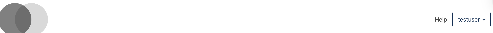
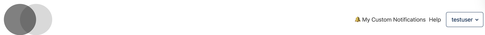
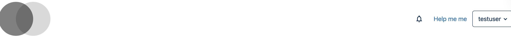
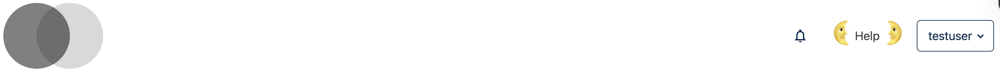
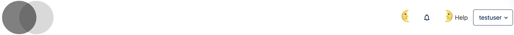

# Learning Header Actions Slot

## Slots

| Slot ID | Description |
|---------|-------------|
| `org.openedx.frontend.layout.learning_header_actions.v2` | Full actions area: notification tray + help link |
| `org.openedx.frontend.layout.learning_header_actions.v1` | Help link only (no notifications) |

---

## `v2` — Full Actions Area

### Slot ID: `org.openedx.frontend.layout.learning_header_actions.v2`

**Default Content:**
- **Notification Tray** (via `HeaderNotificationsSlot`) — Rendered before the help link
- **`LearningHeaderActionsSlotV1`** — Wraps the help link

---

## `v1` — Help Link Only

### Slot ID: `org.openedx.frontend.layout.learning_header_actions.v1`

**Default Content:**
- **LearningHelpSlot** — The help link (question mark icon)

---

## Examples

### Hide Notifications Tray

The following `env.config.jsx` hides the notification. For Learning-only, see example above.


```jsx
const config = {
  pluginSlots: {
    'org.openedx.frontend.layout.header_notifications_tray.v1': {
      keepDefault: false,
      plugins: [],
    },
  },
};

export default config;
```

### Replace Notifications Tray with Custom Component


```jsx
import React from 'react';
import { DIRECT_PLUGIN, PLUGIN_OPERATIONS } from '@openedx/frontend-plugin-framework';

const config = {
  pluginSlots: {
    'org.openedx.frontend.layout.header_notifications_tray.v1': {
      keepDefault: false,
      plugins: [
        {
          op: PLUGIN_OPERATIONS.Insert,
          widget: {
            id: 'custom_notifications_component',
            type: DIRECT_PLUGIN,
            priority: 50,
            RenderWidget: () => (
              <span>🔔 My Custom Notifications</span>
            ),
          },
        },
      ],
    },
  },
};

export default config;
```

### Replace Help Link with Custom Component

To customize just the help link, target `v1` (or `header_learning_help.v1` directly):



```jsx
import React from 'react';
import { DIRECT_PLUGIN, PLUGIN_OPERATIONS } from '@openedx/frontend-plugin-framework';

const config = {
  pluginSlots: {
    'org.openedx.frontend.layout.learning_header_actions.v1': {
      keepDefault: false,
      plugins: [
        {
          op: PLUGIN_OPERATIONS.Insert,
          widget: {
            id: 'custom_help_component',
            type: DIRECT_PLUGIN,
            priority: 50,
            RenderWidget: () => (
              <a href="https://support.example.com">Help</a>
            ),
          },
        },
      ],
    },
  },
};

export default config;
```

### Add Custom Components before and after Help Link

Components with `priority < 50` appear before the default content; `priority > 50` appear after:


```jsx
import React from 'react';
import { DIRECT_PLUGIN, PLUGIN_OPERATIONS } from '@openedx/frontend-plugin-framework';

const config = {
  pluginSlots: {
    'org.openedx.frontend.layout.learning_header_actions.v1': {
      keepDefault: true,
      plugins: [
        {
          op: PLUGIN_OPERATIONS.Insert,
          widget: {
            id: 'custom_before_help_component',
            type: DIRECT_PLUGIN,
            priority: 10,
            RenderWidget: () => (
              <h1 style={{ textAlign: 'center' }}>🌜</h1>
            ),
          },
        },
        {
          op: PLUGIN_OPERATIONS.Insert,
          widget: {
            id: 'custom_after_help_component',
            type: DIRECT_PLUGIN,
            priority: 90,
            RenderWidget: () => (
              <h1 style={{ textAlign: 'center' }}>🌛</h1>
            ),
          },
        },
      ],
    },
  },
};

export default config;
```

### Add Custom Components before and after Notifications Tray



```jsx
import React from 'react';
import { DIRECT_PLUGIN, PLUGIN_OPERATIONS } from '@openedx/frontend-plugin-framework';

const config = {
  pluginSlots: {
    'org.openedx.frontend.layout.header_notifications_tray.v1': {
      keepDefault: true,
      plugins: [
        {
          op: PLUGIN_OPERATIONS.Insert,
          widget: {
            id: 'custom_before_notifications_component',
            type: DIRECT_PLUGIN,
            priority: 10,
            RenderWidget: () => (
              <h1 style={{ textAlign: 'center' }}>🌜</h1>
            ),
          },
        },
        {
          op: PLUGIN_OPERATIONS.Insert,
          widget: {
            id: 'custom_after_notifications_component',
            type: DIRECT_PLUGIN,
            priority: 90,
            RenderWidget: () => (
              <h1 style={{ textAlign: 'center' }}>🌛</h1>
            ),
          },
        },
      ],
    },
  },
};

export default config;
```

