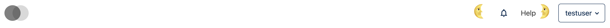
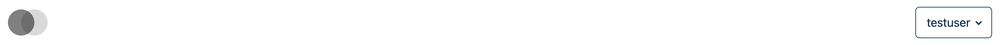
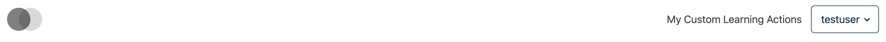

# Learning Header Actions Slot — v2 (Full Learning Header Actions Area)

### Slot ID: `org.openedx.frontend.layout.learning_header_actions.v2`

**Default Content:**
- **Learning Header Actions v1** (via [`LearningHeaderActionsSlotV1`](../v1/)) — Notification tray + help link, only rendered when `showUserDropdown` is `true`

This slot always renders, regardless of the `showUserDropdown` prop passed to `LearningHeader`. Use it to add, hide, or replace the whole actions area independently of `showUserDropdown`.

---

## Examples

### Add Custom Components before and after the Learning Header Actions Area

The following `env.config.jsx` inserts a custom component before the notification tray/help link (`priority: 10`) and another after (`priority: 90`). These render even when `showUserDropdown` is `false`.



```jsx
import React from 'react';
import { DIRECT_PLUGIN, PLUGIN_OPERATIONS } from '@openedx/frontend-plugin-framework';

const config = {
  pluginSlots: {
    'org.openedx.frontend.layout.learning_header_actions.v2': {
      keepDefault: true,
      plugins: [
        {
          op: PLUGIN_OPERATIONS.Insert,
          widget: {
            id: 'custom_before_learning_actions',
            type: DIRECT_PLUGIN,
            priority: 10,
            RenderWidget: () => (
              <h1 style={{ textAlign: 'center' }}>🌜</h1>
            ),
          },
        },
        {
          op: PLUGIN_OPERATIONS.Insert,
          widget: {
            id: 'custom_after_learning_actions',
            type: DIRECT_PLUGIN,
            priority: 90,
            RenderWidget: () => (
              <h1 style={{ textAlign: 'center' }}>🌛</h1>
            ),
          },
        },
      ],
    },
  },
};

export default config;
```

### Hide the Entire Learning Header Actions Area

The following `env.config.jsx` removes the actions area (notification tray + help link) from the learning header, regardless of `showUserDropdown`.



```jsx
import { PLUGIN_OPERATIONS } from '@openedx/frontend-plugin-framework';

const config = {
  pluginSlots: {
    'org.openedx.frontend.layout.learning_header_actions.v2': {
      keepDefault: true,
      plugins: [
        {
          op: PLUGIN_OPERATIONS.Hide,
          widgetId: 'default_contents',
        },
      ],
    },
  },
};

export default config;
```

### Replace the Entire Learning Header Actions Area with a Custom Component

The following `env.config.jsx` replaces the actions area with a single custom component that renders regardless of `showUserDropdown`.



```jsx
import React from 'react';
import { DIRECT_PLUGIN, PLUGIN_OPERATIONS } from '@openedx/frontend-plugin-framework';

const config = {
  pluginSlots: {
    'org.openedx.frontend.layout.learning_header_actions.v2': {
      keepDefault: false,
      plugins: [
        {
          op: PLUGIN_OPERATIONS.Insert,
          widget: {
            id: 'custom_learning_actions',
            type: DIRECT_PLUGIN,
            priority: 50,
            RenderWidget: () => (
              <span>My Custom Learning Actions</span>
            ),
          },
        },
      ],
    },
  },
};

export default config;
```
