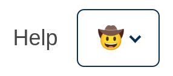
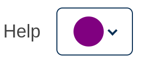
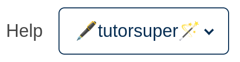

# Learning Username Slot

### Slot ID: `learning_username_slot`

## Description

This slot is used to replace/modify/hide the learning username.

## Examples

### Modify Username

The following `env.config.jsx` will modify the username (in this case replacing it with 🤠)



```jsx
import { PLUGIN_OPERATIONS } from '@openedx/frontend-plugin-framework';

const modifyUsername = ( widget ) => {
  widget.content.username = "🤠";
  return widget;
};

const config = {
  pluginSlots: {
    learning_username_slot: {
      keepDefault: true,
      plugins: [
        {
          op: PLUGIN_OPERATIONS.Modify,
          widgetId: 'default_contents',
          fn: modifyUsername,
        },
      ]
    },
  },
}

export default config;
```


### Replace Username with Custom Component

The following `env.config.jsx` will replace the items in the learning username entirely (in this case with an svg circle)



```jsx
import { DIRECT_PLUGIN, PLUGIN_OPERATIONS } from '@openedx/frontend-plugin-framework';

const config = {
  pluginSlots: {
    learning_username_slot: {
      keepDefault: false,
      plugins: [
        {
          op: PLUGIN_OPERATIONS.Insert,
          widget: {
            id: 'custom_username_component',
            type: DIRECT_PLUGIN,
            RenderWidget: () => (
              <svg height="30" width="30">
                <circle r="15" cx="15" cy="15" fill="purple" />
              </svg>
            ),
          },
        },
      ]
    },
  },
}

export default config;
```

### Add Custom Components before and after Username

The following `env.config.jsx` will place custom components before and after the learning username (in this case 🖋️ and 🪄).



```jsx
import { DIRECT_PLUGIN, PLUGIN_OPERATIONS } from '@openedx/frontend-plugin-framework';

const config = {
  pluginSlots: {
    learning_username_slot: {
      keepDefault: true,
      plugins: [
        {
          op: PLUGIN_OPERATIONS.Insert,
          widget: {
            id: 'custom_before_username_component',
            type: DIRECT_PLUGIN,
            priority: 10,
            RenderWidget: () => "🖋️",
          },
        },
        {
          op: PLUGIN_OPERATIONS.Insert,
          widget: {
            id: 'custom_after_username_component',
            type: DIRECT_PLUGIN,
            priority: 90,
            RenderWidget: () => "🪄",
          },
        },
      ]
    },
  },
}

export default config;
```
