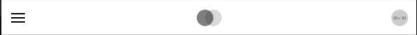
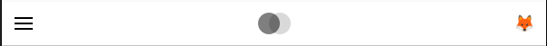

# Mobile User Menu Toggle Slot

### Slot ID: `org.openedx.frontend.layout.header_mobile_user_menu_trigger.v1`

## Description

This slot is used to replace/modify/hide the contents of the user menu toggle button on mobile screens.

## Examples

### Modify Avatar

The following `env.config.jsx` will modify the icon for the user menu toggle button on mobile.



```jsx
import { PLUGIN_OPERATIONS } from '@openedx/frontend-plugin-framework';

const modifyUserMenuToggle = ( widget ) => {
  // Shows a dummy image with the resolution marker '30x30'.
  widget.content.avatar = "https://dummyimage.com/30x30"
  return widget;
};

const config = {
  pluginSlots: {
    'org.openedx.frontend.layout.header_mobile_user_menu_trigger.v1': {
      keepDefault: true,
      plugins: [
        {
          op: PLUGIN_OPERATIONS.Modify,
          widgetId: 'default_contents',
          fn: modifyUserMenuToggle,
        },
      ]
    },
  },
}

export default config;
```

### Replace Menu toggle contents with Custom Component

The following `env.config.jsx` will replace the contents of the user menu toggle button's contents entirely (in this case with an emoji).



```jsx
import { DIRECT_PLUGIN, PLUGIN_OPERATIONS } from '@openedx/frontend-plugin-framework';

const config = {
  pluginSlots: {
    'org.openedx.frontend.layout.header_mobile_user_menu_trigger.v1': {
      keepDefault: false,
      plugins: [
        {
          op: PLUGIN_OPERATIONS.Insert,
          widget: {
            id: 'custom_mobile_user_menu_toggle',
            type: DIRECT_PLUGIN,
            RenderWidget: () => (
              <span>🦊</span>
            ),
          },
        },
      ]
    },
  },
}

export default config;
```
