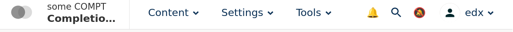

# Studio Header Search Button Slot

### Slot ID: `org.openedx.frontend.layout.studio_header_search_button_slot.v1`

## Description

This slot is used to replace/modify/hide the search button in the studio header.

## Examples

### Replace search with custom component

The following `env.config.jsx` will replace the search button entirely (in this case with a custom emoji icon):


```jsx
import {
  DIRECT_PLUGIN,
  PLUGIN_OPERATIONS,
} from "@openedx/frontend-plugin-framework";

const config = {
  pluginSlots: {
    "org.openedx.frontend.layout.studio_header_search_button_slot.v1": {
      keepDefault: false,
      plugins: [
        {
          op: PLUGIN_OPERATIONS.Insert,
          widget: {
            id: "custom_notification_tray",
            type: DIRECT_PLUGIN,
            RenderWidget: () => <span>🔔</span>,
          },
        },
      ],
    },
  },
};

export default config;
```

### Add custom component before and after search button

The following `env.config.jsx` will insert emoji after and before the search button



```jsx
import {
  DIRECT_PLUGIN,
  PLUGIN_OPERATIONS,
} from "@openedx/frontend-plugin-framework";

const config = {
  pluginSlots: {
    "org.openedx.frontend.layout.studio_header_search_button_slot.v1": {
      keepDefault: true,
      plugins: [
        {
          op: PLUGIN_OPERATIONS.Insert,
          widget: {
            priority: 10,
            id: 'custom_notification_tray_before',
            type: DIRECT_PLUGIN,
            RenderWidget: () => <span>🔔</span>,
          },
        },
        {
          op: PLUGIN_OPERATIONS.Insert,
          widget: {
            priority: 90,
            id: 'custom_notification_tray_after',
            type: DIRECT_PLUGIN,
            RenderWidget: () => <span>🔕</span>,
          },
        },
      ],
  },
};

export default config;
```

## API

- **Slot ID:** `org.openedx.frontend.layout.studio_header_search_button_slot.v1`
- **Component:** Uses the [PluginSlot](https://github.com/openedx/frontend-plugin-framework#pluginslot) from the Open edX Frontend Plugin Framework for plugin injection.
